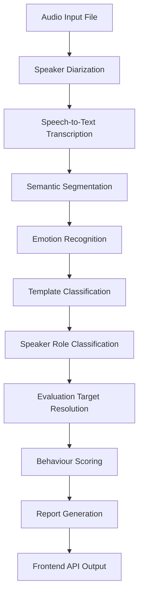
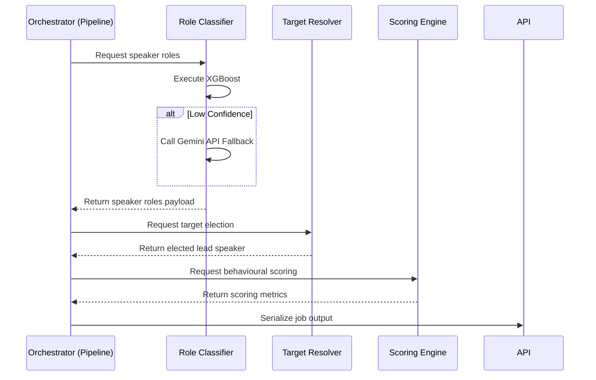

# Developer Architecture Guide: SpeechInSight Processing Pipeline

This document provides a detailed technical guide to the SpeechInSight backend processing pipeline. It is intended for software engineers and machine learning researchers maintaining or extending the system.

---

## 1. Overview

The processing pipeline orchestrates the transformation of raw audio files into structured behavioural evaluations, emotion analysis, role predictions, and meeting metadata. The system is designed around a decoupled, post-inference execution flow. This separates raw NLP model predictions from business logic target resolution, guaranteeing stable API delivery and predictable fallback execution.

---

## 2. High-Level Architecture

The flowchart below represents the linear processing sequence from raw media import through machine learning inference to delivery via the Frontend API.



---

## 3. Pipeline Stages

The following table summarizes the inputs, outputs, modules, and core execution responsibilities of each stage in the processing lifecycle.

| Stage | Module | Input | Output | Responsibility |
| :--- | :--- | :--- | :--- | :--- |
| **Diarization** | `pipeline/diarization` | Raw Audio | Speaker segments with timestamp boundaries | Cluster audio frames into unique speaker identifiers |
| **Speech-to-Text** | `pipeline/transcription` | Audio segments | Transcribed text segments | Perform automatic speech recognition per segment |
| **Semantic Segmentation** | `pipeline/segmentation` | Raw transcripts | Structured conversational turns | Align timestamps with text and group into speech turns |
| **Emotion Recognition** | `pipeline/emotion` | Segment text | Emotion labels and confidence scores | Analyze emotional tone (e.g., Happy, Angry, Neutral) |
| **Template Classification**| `pipeline/templates` | Segment text | Speech template classifications | Map turns to behavioural categories (e.g., Praise, Direct) |
| **Role Classification** | `pipeline/role_classification` | Aggregated speaker texts | Speaker roles and class probabilities | Classify participants into domains (Leader, HR, Junior, Other) |
| **Target Resolution** | `pipeline/lead_speaker` | Aggregated roles and probabilities | Single elected Evaluation Leader | Resolve meeting-level ambiguity to elect one evaluation target |
| **Behaviour Scoring** | `pipeline/scoring` | Evaluated turns | Quantitative performance scores | Score participant interactions using rule-based metrics |
| **Report Generation** | `pipeline/orchestrator` | Aggregate states | Structured JSON report payload | Compile results into final JobResult schema |

---

## 4. Directory Structure

The `pipeline/` directory is structured as follows:

```
pipeline/
│
├── emotion/                  # Emotion recognition models and feature extractors
├── role_classification/      # TF-IDF vectorization and XGBoost predictor stage
├── lead_speaker/             # Post-inference Evaluation Target Resolver
│
├── schemas.py                # Pydantic schemas for JobResult and SegmentResult
├── scoring.py                # Rule-based behavioural metrics calculator
└── feature_pipeline.py       # Audio/text feature extraction pipelines
```

* **`emotion/`**: Hosts NLP models used to analyze user vocal tone and textual sentiment.
* **`role_classification/`**: Houses model checkpoints (e.g., SVD and XGBoost classifiers) and the hybrid agentic router which handles the Gemini LLM fallback.
* **`lead_speaker/`**: Implements the model-independent decision engine electing the primary evaluation candidate.
* **`schemas.py`**: Defines the data contracts between processing layers and the API.
* **`scoring.py`**: Calculates meeting-level summary scores (e.g. communication efficiency and engagement).

---

## 5. Role Classification Architecture

Speaker roles are predicted using a hybrid inference approach designed to minimize LLM usage while maintaining classification accuracy.

```
                    +-----------------------------+
                    |    Aggregated Speaker Text  |
                    +--------------+--------------+
                                   |
                                   ▼
                    +-----------------------------+
                    |    TF-IDF Vectorization     |
                    +--------------+--------------+
                                   |
                                   ▼
                    +-----------------------------+
                    |     XGBoost Classifier      |
                    +--------------+--------------+
                                   |
                                   ▼
                     Is Max Class Probability >= 0.8?
                      /                         \
                    Yes                          No
                    /                             \
     +-----------------------------+  +-----------------------------+
     | Accept XGBoost Prediction   |  |   Trigger Gemini Fallback   |
     +--------------+--------------+  +--------------+--------------+
                    |                                |
                    |                         Gemini Successful?
                    |                           /          \
                    |                         Yes          No (Timeout / API Error)
                    |                         /              \
                    |           +-------------------------+  +-------------------------+
                    |           | Accept Gemini Role      |  | Fallback to XGBoost Role|
                    |           +------------+------------+  +------------+------------+
                    \                        |                           /
                     \-----------------------+--------------------------/
                                             |
                                             ▼
                              +-----------------------------+
                              | Normalized Canonical Role   |
                              +-----------------------------+
```

### Steps in the Hybrid Pipeline
1. **TF-IDF & SVD Transform:** Text features are vectorized and mapped to reduced dimensions.
2. **XGBoost Inference:** Predictions generate a class probability distribution across four categories: Leader, HR, Junior, and Other.
3. **Confidence Routing:** If the probability of the predicted class is $\ge 0.80$, the prediction is accepted directly.
4. **Gemini Fallback:** If confidence is $< 0.80$, the transcript and conversation metadata are packaged into a structured prompt and evaluated via Gemini.
5. **Role Normalization:** Predictions from all sources are mapped to canonical role labels: `Leader`, `HR`, `Junior`, `Other`.
6. **Provenance Logging:** The full classification path, including intermediate XGBoost probabilities, Gemini status, final role, and source of truth, is preserved in the speaker result payload.

---

## 6. Evaluation Target Resolution

Role Classification and Evaluation Target Resolution are treated as two independent stages in the pipeline.

### Architectural Rationale
- **Classification vs. Business Rules:** Classification models analyze individual speaker text patterns to predict their organizational role. Resolving who the main evaluation target is for the meeting requires processing meeting-level context (e.g. total participants, openers/closers).
- **Taxonomy Independence:** The resolver is model-independent. It does not depend on model weights or classification implementations, meaning NLP models can be retrained or replaced without affecting the resolution logic.

### Comparison: Old vs. New Resolver
- **Legacy System:** Depended purely on speaking duration. If a junior developer spoke longer than the lead during a code review, the pipeline incorrectly evaluated the junior developer.
- **Role-Based Resolver:** Implements a deterministic hierarchy based on finalized speaker roles, conversation structure, and confidence margins:

```
1. Exactly One Candidate Predicted as "Leader" -> Elect candidate immediately.
2. Multiple Candidates:
   a. Check if one has a clear probability margin (> 5% difference).
   b. If tied, select opener or closer of the meeting.
   c. If still tied, fallback to speaking duration.
3. No Candidates (Proximity Check):
   a. Identify candidate with highest "Leader" class probability.
   b. Fallback to structure, else speaking duration.
```

---

## 7. Data Structures

The pipeline relies on structured Pydantic models defined in `pipeline/schemas.py`.

### `JobResult`
Represents the complete processed state of an analysis job.
- `job_id`: Unique identifier string.
- `segments`: List of `SegmentResult` instances.
- `speaker_roles`: Dictionary mapping `SpeakerID` to speaker provenance structures.
- `lead_speaker`: Elect evaluation target speaker string.
- `metadata`: Contains engine details, including the `leader_resolution` audit log.

### `SegmentResult`
Represents a single conversational turn.
- `speaker`: Speaker identification string (e.g., `SPEAKER_01`).
- `start`: Start timestamp (float).
- `end`: End timestamp (float).
- `text`: Transcribed turn text.
- `sentiment`: Sentiment score.
- `emotion`: Predicted dominant emotion.
- `role`: Canonical role at the time of turn.

### `speaker_roles` Provenance Schema
Each speaker entry contains metadata detailing how their role was predicted:
```json
{
  "speaker": "SPEAKER_01",
  "predicted_role": "Leader",
  "confidence": 0.85,
  "xgboost": {
    "role": "Leader",
    "confidence": 0.85,
    "probabilities": { "Leader": 0.85, "HR": 0.05, "Junior": 0.05, "Other": 0.05 }
  },
  "gemini": {
    "used": false,
    "role": null
  },
  "final_role": "Leader",
  "prediction_source": "xgboost"
}
```

---

## 8. Error Handling

The processing pipeline guarantees delivery through fallback mechanics at critical failure points:

- **Model Loading Failures:** If the XGBoost or TF-IDF model artifacts cannot be loaded, the pipeline falls back to rule-based keyword classification matching.
- **Gemini Timeout / API Exceptions:** The fallback network call is wrapped in a `try-except` block. If the API times out, returns invalid JSON, or raises network errors, the warning is logged, the classification source is set to `xgboost` (fallback), and the original XGBoost prediction is accepted.
- **Missing Probabilities:** If a model returns an empty probability distribution, the resolver falls back to conversation structure (opener/closer matching) and duration metrics, preventing pipeline execution failure.

---

## 9. Extending the Pipeline

To add or modify pipeline components without breaking downstream stages:

### Adding a New Classifier
1. Implement the classifier in `pipeline/role_classification/`.
2. Ensure it exposes a `predict_role()` method returning the canonical labels: `Leader`, `HR`, `Junior`, `Other`.
3. Update `pipeline/orchestrator.py` to route speaker features to the new module.

### Modifying the Resolver
1. Edit `pipeline/lead_speaker/__init__.py`.
2. Ensure the class inherits from `BaseLeadSpeakerIdentifier` and returns a single `SpeakerID` string.
3. Preserve the backwards-compatible aliases (`StubLeadSpeakerIdentifier` and `LeaderResolver`).

### Adding a New API Field
1. Add the field to the schema definitions in `pipeline/schemas.py`.
2. Update the report compilation method in `pipeline/orchestrator.py` to populate the field.
3. Update the endpoint serialization structure in `api.py`.

---

## 10. Design Principles

- **Separation of Concerns:** Model inference is strictly decoupled from evaluation logic. The resolver operates exclusively on post-inference predictions.
- **deterministic Execution:** Given the same set of roles and transcript stats, the resolver will select the same target speaker, ensuring reproducible audits.
- **Graceful Degradation:** The pipeline utilizes robust error handling to continue processing when third-party services fail.
- **Prediction Provenance:** All classification decisions carry debugging paths, allowing developers to inspect model logic in developer mode.

---

## 11. Execution Lifecycle

This diagram demonstrates the lifecycle of a pipeline run:



---

## 12. Configuration

Configurable parameters are located in the application environment files or system config blocks:

* `CONFIDENCE_THRESHOLD`: Probability score threshold (default: `0.80`).
* `PROBABILITY_TOLERANCE`: Resolution tie-break margin (default: `0.05` / 5%).
* `GEMINI_FALLBACK_ENABLED`: Boolean toggle to control fallback requests (default: `True`).
* `MODEL_PATH`: Directory path containing the XGBoost classifier model.

---

## 13. Future Extensions

* **Transformer-Based Classifier:** Replace the SVD + XGBoost classification layer with a fine-tuned transformer (e.g. DeBERTa) for contextual turn embedding.
* **End-to-End Embeddings:** Extract speaker embeddings directly from diarization frames to map physical identities to role profiles.
* **Confidence Calibration:** Calibrate model confidence using temperature scaling to improve XGBoost probability reliability.
* **Active Learning Loop:** Route low-confidence turns to human annotators, updating XGBoost training datasets continuously.

---

## 14. Developer Notes

- **Debugging Entry Point:** Use the `scratch/test_leader_resolver.py` harness to test resolver decision paths locally.
- **Intermediate Files:** Intermediate features and SVD dimensions are stored in memory during processing and are not written to disk.
- **Interface Stability:** The interfaces of `schemas.py` and `lead_speaker/__init__.py` must remain stable, as they are consumed by the API and the React presentation layer.